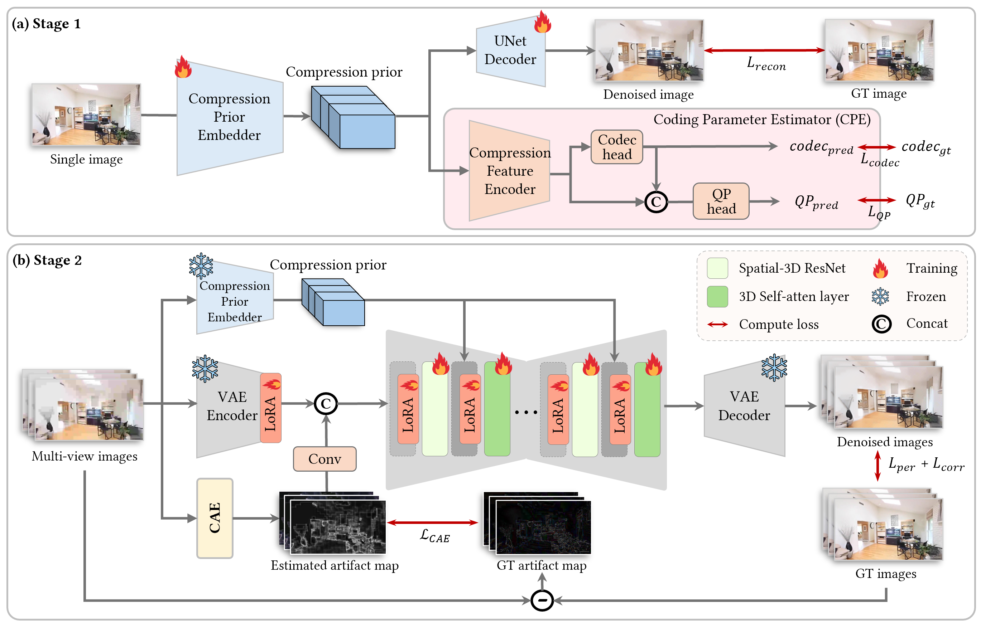
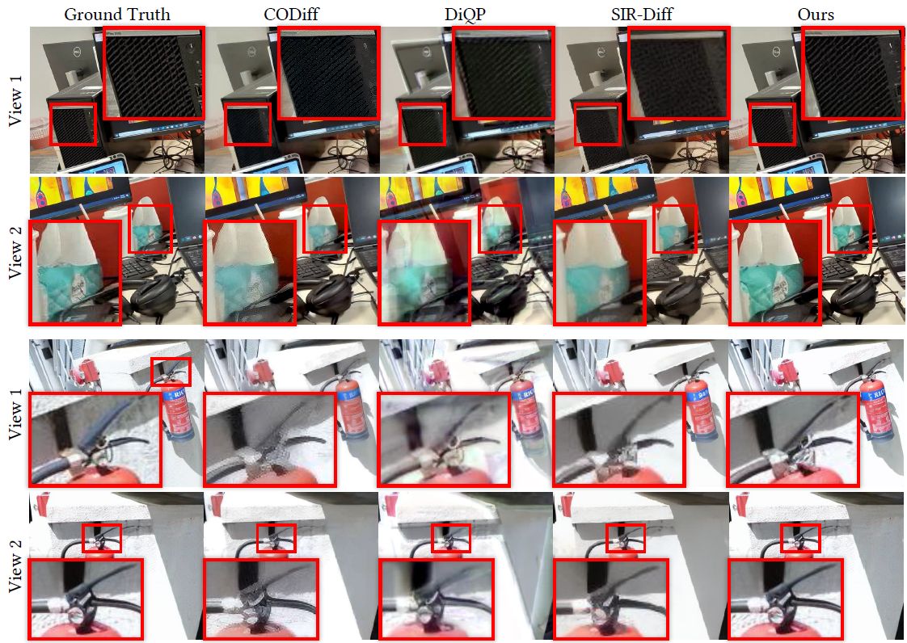
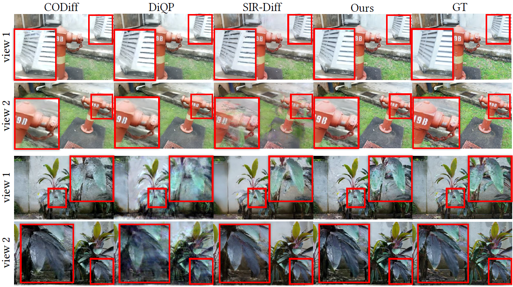
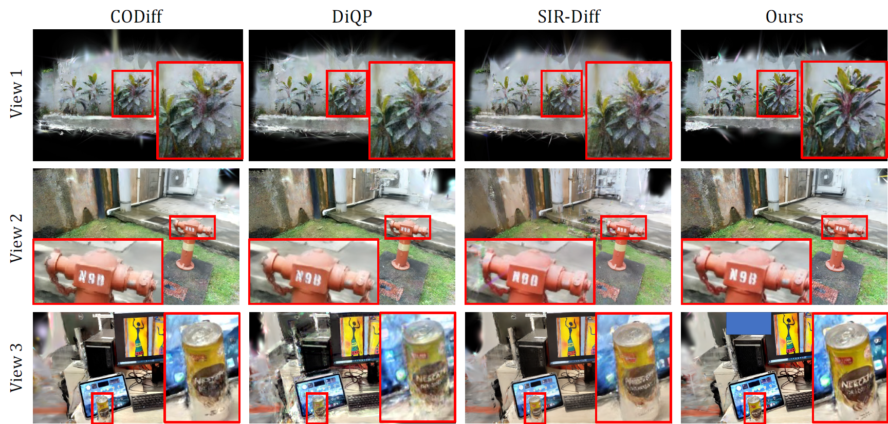

# CompMVR: Compression-Aware Multi-View Restoration Using Diffusion Models for Geometrically Consistent 3D Reconstruction

<p align="center">
  <!-- <a href="#">
    
  </a> -->
  <a href="https://github.com/mchaewon/CompMVR-project-page">
    
  </a>
</p>

<p align="center">
  ⭐ <b>Accepted by SIGGRAPH-ASIA 2026</b>
</p>

## 🔥 News
- **2026-06** SIGGRAPH-ASIA 2026 Accepted
- **2026-09** Code released.

## TODO

- [x] Release the main code 
- [ ] Release pre-trained checkpoints
- [ ] Release datasets

## 📌 Framework
<p align="center">
  
</p>

## ⚙️ Dependencies & Installation
```bash
git clone https://github.com/mchaewon/CompMVR.git
cd CompMVR
```

**Docker** (recommended):

```bash
docker build -t compmvr:latest .
docker run -it --gpus '"device=0"' --shm-size 16G \
  -v $(pwd):/compmvr -v /path/to/compmvr/data:/dataset \
  compmvr:latest /bin/bash
```

**Conda** 

```bash
conda create -n compmvr python=3.10
conda activate compmvr

```
**Install**
```bash
pip install -r requirements.txt
```

## ⚡ Quick Inference

### Step 1: Download the Pretrained Models

Download the following models:

| Model | Description | Link |
|---|---|---|
| SD 2.1-base | Base diffusion model | [Stable Diffusion 2.1-base](https://huggingface.co/Manojb/stable-diffusion-2-1-base) |
| CompMVR | CompMVR stage 1 checkpoint | coming soon |
| CompMVR | CompMVR stage 2 checkpoint | coming soon |
<!-- | CompMVR | CompMVR stage 1 checkpoint | [compmvr_s1.pkl](#) |
| CompMVR | CompMVR stage 2 checkpoint | [compmvr_s2.pkl](#) | -->

### Step 2: Prepare the test datasets

test datasets coming soon.

### Step 3: Run Inference

```bash
bash scripts/main_test.sh
```

## 🖼️ Results

### Visual Comparison

#### 2D restoration results
<p align="center">
  
</p>

#### NVS results rendered at GT camera poses
<p align="center">
  
</p>

#### Synthesized novel 3D views
<p align="center">
  
</p>


## License

This project is released under the Apache 2.0 license.

## Acknowledgments

Our project builds upon [CODiff](https://github.com/jp-guo/codiff). We sincerely thank the authors for their awesome work.

## Citations

```bash
#
```
